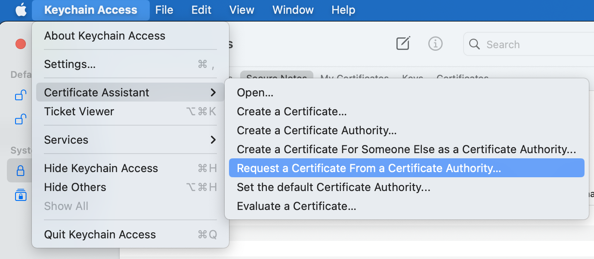
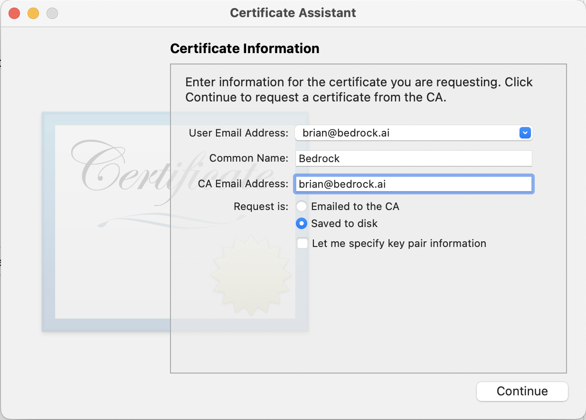

## Generate MacOS Certificates

#### Generate "Certificate Signing Request" via Keychain

You will need to generate two of them, one for each of certificates generated, since they could be used only once

- Open Keychain
- Go to app settings and choose `Certificate Assistant -> Request a Certificate From a Certificate Authority`

- On the next page enter User Email Address (`brian@bedrock.ai`), Common name, `Bedrock` and CA Email Address, `brian@bedrock.ai`
- Choose `Save to disk`

#### Generate actual certificates

- Go to https://developer.apple.com/account/resources/certificates/list
- You will need to login with account that owns `Prometheon Systems, Inc.` (ask Brian)
- Click on "+"
- You will need two certificates, `Developer ID Application` and `Developer ID Installer`, if your app will be distributed outside the Mac App Store. It is current preferred option (for distribution inside App Store, choose `Mac App Distribution` and `Mac Installer Distribution` instead)

- On the next page choose "G2 Sub-CA" Profile Type
- Then click `Choose File` under "Certificate Signing Request" and choose one of the Certificate Signing Request files generated before

#### Download Apple Intermediate Certificates

- Go to https://www.apple.com/certificateauthority/
- Download `Developer ID - G2` certificate
- Then download one more, `Worldwide Developer Relations - G2`

#### Replace old certificate

Remove all existing certs from `MacOS-certificates` dir and replace them with new ones. There should be total 4 files
