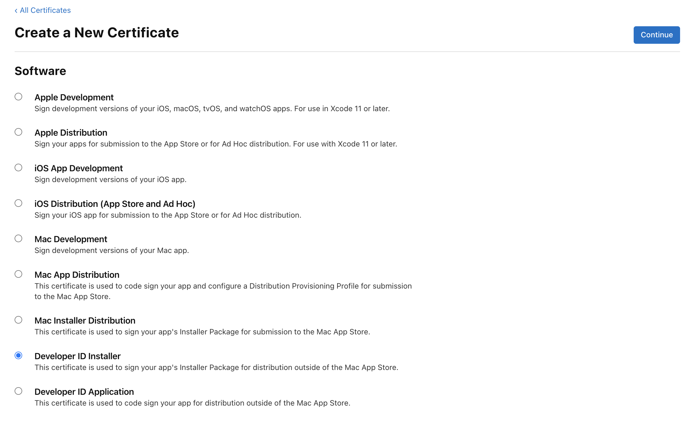
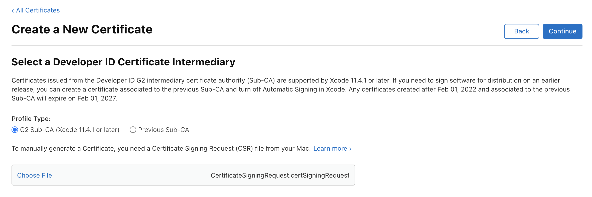

## Generate MacOS Certificates

#### Generate private key and CSR-file

Key will be used on later stage, csr-file you will use on the next step to retrieve the cer-file from Apple website

    openssl req -new -newkey rsa:2048 -nodes -keyout developerIdApplication.key -out developerIdApplication.csr

Answer the questions as following:
Country: US
State: California
Org/Company: Prometheon Systems, Inc
Name: Bedrock
Email: brian@bedrock.ai
Password: <secure_password>

For the password, you will need to also update `CSC_KEY_PASSWORD` env secret in GihHub Actions Secrets.

#### Generate CER-format certificates

- Go to https://developer.apple.com/account/resources/certificates/list
- You will need to login with account that owns `Prometheon Systems, Inc.` (ask Brian)
- Click on "+"
- You will need `Developer ID Application`, if your app will be distributed outside the Mac App Store. It is current preferred option (for distribution inside App Store, choose `Mac App Distribution` instead)

- On the next page choose "G2 Sub-CA" Profile Type
- Then click `Choose File` under "Certificate Signing Request" and choose CSR-file generated before

#### Download Apple Intermediate Certificates

- Go to https://www.apple.com/certificateauthority/
- Download `Developer ID - G2` certificate
- Then download one more, `Worldwide Developer Relations - G2`

#### Convert the .cer file into .pem format:

    openssl x509 -in developerID_application.cer -inform DER -out developerID_application.pem -outform PEM

#### Use the .pem file and your private .key to generate .p12 file:

    openssl pkcs12 -export -out developerID_application.p12 -inkey developerIdApplication.key -in developerID_application.pem

It will ask for the password. Use the one you've setup on the first step

#### Replace all generated files

Put all new files into `./MacOS-certificates` dir with replacing
